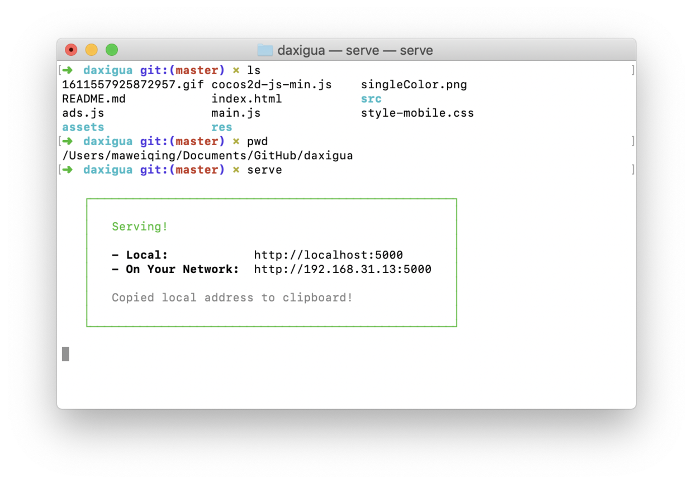
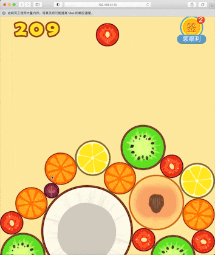

## 合成大西瓜

第一步，扫码或者长按识别下面的二维码，关注「沉默王二」公众号：


第二步，在公众号后台发送 **大西瓜** 获取在线试玩地址。

### 本地启动

第一步，安装 Node.js，可以通过下面的路径下载安装包。

>http://nodejs.cn/download/

安装完成后通过 `npm -v` 查看是否安装成功。npm 是 Node.js 的模块管理器，功能及其强大。

第二步，安装 Vue CLI，一个基于 Vue.js 进行快速开发的完整系统，提供了一个运行时依赖。文档见一下路径：

>https://cli.vuejs.org/zh/guide/

安装完成后通过 `vue --version` 查看是否安装成功。

第三步，安装 serve 服务，可通过 `npm i serve -g` 命令进行安装，如果 npm 安装比较慢的话，可以通过 `cnpm` 来安装。cnpm 是淘宝提供的一个 npm 的镜像，国内访问的速度更快。

如果出现 `Error: EACCES: permission denied` 表示没有权限，需要在命令前面加上 `sudo`，我在《[Shell，牛逼](https://mp.weixin.qq.com/s/oEo8N3nE0wR1zl7qD4nh3w)》 这篇内容里有解释。

安装完成后通过 `serve -v` 查看是否安装成功。

第四步，进入到合成大西瓜的源码包下，执行 `serve` 启动本地 Web 服务。



第五步，在浏览器地址栏键入本地或者网络可以访问的地址就可以启动 Web 服务器了。趁机玩了一把，舒服了。



 第六步，想要修改只需在 src/project.js 文件中搜索 '// '（斜杠斜杠空格），就能快速找到对应修改位置！

### 魔改原理

游戏的过程是：点击 => 碰撞 => 计分 => 展示

#### 1. 改分数

改分数有两种实现方式，修改计分规则，或者修改最后要展示的分数。原理很简单，搜索分数对应的英文单词 "score" 或者添加分数 "addScore"。

发现分数是由 default.score 作为统计值的，有这么一行代码：

```javascript
a.default.score += this.fruitNumber + 1
```

那我只要把基数 1 改为自己定义的数字即可~ 当然也可以让用户自己输入！

```javascript
a.default.score += this.fruitNumber + extraScore
```

当然，这种方式玩游戏就没有多少意思啦~

#### 2. 改图片

改图片的原理非常简单，直接找到原有的图片，然后用相同名称、相同格式、相同尺寸的图片进行替换即可！

我帮大家整理了图片替换表，地址如下：

【腾讯文档】魔改大西瓜可替换的素材 https://docs.qq.com/sheet/DS0d2VVVJYmpvZ0pZ

还有其他魔改方式，比如每次都下落相同水果，思路就是 "定位代码" => "修改调试"。持续补充！

大家可以学习下作者的源码，真的强！

关于魔改的更多参数，可以参照鱼皮老弟的文章：

>https://juejin.cn/post/6923047027475644430

### 发布上线

在本地修改好代码后，怎么发布到网上供其他人访问呢？

这里提供最简单的两种方法，不需要购买域名，也不需要买服务器！用户量不大的话，完全免费！

1. 使用 Vercel，在网页 index.html 文件所在目录通过一行命令即可自动发布到它提供的服务器并生成可访问的网址，还能和自己的域名绑定！（我的魔改版就是这么发布的）

2. 使用腾讯云静态网站托管服务，下载官方工具，也是一行命令，即可发布至腾讯云服务器！

可以参考这两篇文章的方式部署自己的网站：

腾讯云静态托管：[docsify+云开发，高效创造你的文档网站​](https://mp.weixin.qq.com/s/Noe90mhVssuBcySyb6TTNA)

Vercel：[尝鲜 Svelte 新框架，动手开发读书笔记](https://mp.weixin.qq.com/s/W-TWxOJTr4gSQkCyIquNuA)

后面会给大家出详细的独立部署教程！


